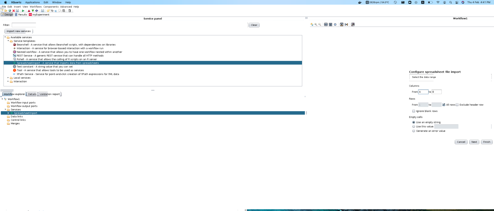

# Taverna Docker version

## Prequisit
1. Install `xquartz` ans `socat`  
`brew install --cask xquartz`  
`brew install socat`

2. Launch XQuartz, select preference, go to security tab, check `Allow connections from network clients`  
3. Start the TCP listen:  
`socat TCP-LISTEN:6000,reuseaddr,fork UNIX-CLIENT:\"$DISPLAY\"`
   

## Build the image  
`docker build -t ken/test-taverna-jdk8 .`

## Get into the terminal
`docker run --rm -it ken/test-taverna-jdk8`  
- java version: 
```bash
openjdk version "1.8.0_275"
OpenJDK Runtime Environment (build 1.8.0_275-8u275-b01-0ubuntu1~18.04-b01)
OpenJDK 64-Bit Server VM (build 25.275-b01, mixed mode)

```
- JAVA_HOME: `/usr/lib/jvm/java-8-openjdk-amd64/`  


## Run the image
1. Start the TCP listen:  
`socat TCP-LISTEN:6000,reuseaddr,fork UNIX-CLIENT:\"$DISPLAY\"`
2. Run the container 
`docker run --rm -p 5000:5000 -e DISPLAY=172.20.10.75:0 ken/test-taverna-jdk8`

## Result


## Reference
1. [openjdk-8-jdk](https://hub.docker.com/r/picoded/ubuntu-openjdk-8-jdk/dockerfile/)
2. [docker-java-ssh-x-forward](https://github.com/Pozo/docker-java-ssh-x-forward)
3. [taverna-workbench](https://github.com/mohsensoori/taverna-workbench)
4. [vnc_startup](https://github.com/ConSol/docker-headless-vnc-container/blob/master/src/common/scripts/vnc_startup.sh)
5. [Running X11 GUI + XQuartz](https://gist.github.com/dahlia/4e8dc41ff29a86d08790589ca6f66174)
6. [x11_docker_mac](https://gist.github.com/cschiewek/246a244ba23da8b9f0e7b11a68bf3285)
7. [Gui application docker and Mac](https://sourabhbajaj.com/blog/2017/02/07/gui-applications-docker-mac/)
8. [Docker for Mac and GUI applications](https://fredrikaverpil.github.io/2016/07/31/docker-for-mac-and-gui-applications/)
9. [Running GUI’s with Docker on Mac OS X](https://cntnr.io/running-guis-with-docker-on-mac-os-x-a14df6a76efc)